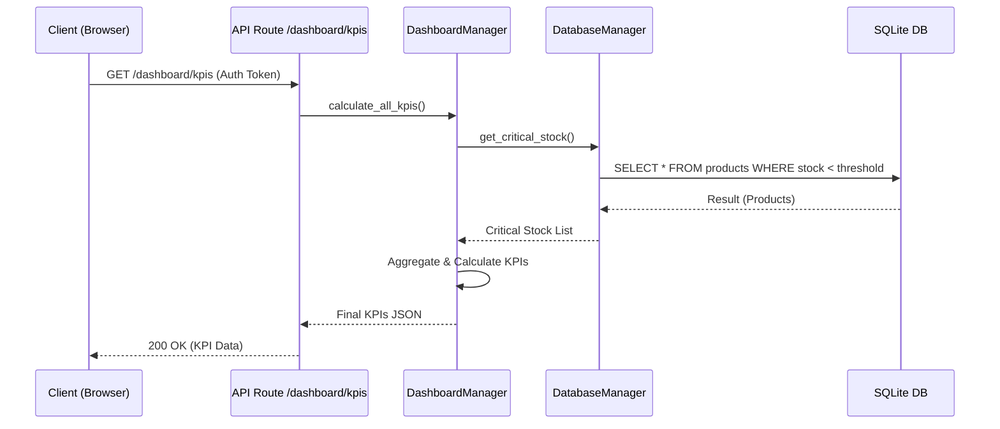
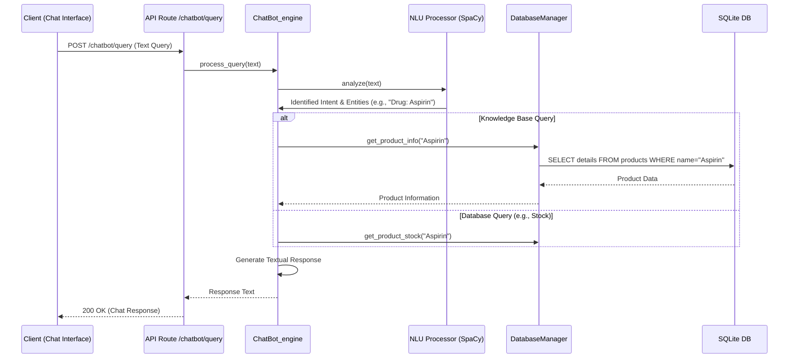

# 📚 Technical Documentation: Pharma Dashboard API

This document provides the architecture, technical design, and development strategies for the **Pharma Dashboard & Chatbot** project.

## 1\. Design System Architecture

### 1.1 High-Level Architecture Diagram

The application follows a three-layered **Client-Server Architecture**, emphasizing Separation of Concerns and a robust RESTful API.

```mermaid
graph TD
    subgraph Client [Presentation Layer (Web Frontend)]
        A[HTML/CSS/JavaScript] -- REST Requests (JSON) --> B(API Gateway/Router)
    end

    subgraph Server [Application Logic Layer (Python Backend)]
        B --> R{Request Routing}

        subgraph API & Services Management (api/ folder)
            R --> P[API Products/Inventory]
            R --> S[API Sales/Transactions]
            R --> U[API Users/Auth]
            R --> CD[API Clients/Doctors]
            R --> CB[Chatbot API]
        end
        
        S --> M(DashboardManager)
        
        % Logical Dependencies
        CB --> E[NLU Processor (SpaCy)]
        P --> F(DatabaseManager)
        S --> F
        U --> F
        CD --> F
        M --> F
    end

    subgraph Persistence [Data Layer]
        F --> H((SQLite Database))
        E --> I[[Drug Knowledge Files]]
    end
```

-----

## 2\. Define Components, Classes, and Database Design

### 2.1 Final Class Diagram

This diagram outlines the core classes, highlighting inheritance (`BaseModel`, `PersonModel`), and the composition of the complex sale transaction.

### 2.2 Entity-Relationship (ER) Model: Summary Table

The database schema is based on 6 core entities, ensuring data integrity for inventory, sales, and prescription tracking.

| Entity (Table) | Purpose | Key Attributes (Columns) | Relationships (Foreign Keys) |
| :--- | :--- | :--- | :--- |
| **USER** | Employee accounts and access control. | `id` (PK), `username`, `password_hash`, `is_admin` | **1:N with SALE, CLIENT, DOCTOR** |
| **PRODUCT** | Inventory of drugs and products. | `id` (PK), `name`, `stock`, `price`, `active_ingredient` | **N:M with SALE** (via `SALE_ITEM`) |
| **CLIENT** | Client records. | `id` (PK), `first_name`, `email`, `user_id` (FK) | **N:1 with USER**<br>**N:1 with SALE** |
| **DOCTOR** | Physician records. | `id` (PK), `first_name`, `email`, `phone`, `specialty` | **N:1 with USER**<br>**N:1 with SALE** |
| **SALE** | The overarching transaction (receipt). | `id` (PK), `total_amount`, `sale_date`, `user_id` (FK), `client_id` (FK), `doctor_id` (FK) | **1:N with SALE\_ITEM** |
| **SALE\_ITEM** | **Junction Table** (Line item in a sale). | `sale_id` (FK), `product_id` (FK), `quantity`, `price_at_sale` | **N:1 with SALE**<br>**N:1 with PRODUCT** |

-----

## 3\. Interaction and Flow Diagrams

### 3.1 Dashboard Loading Flow (KPIs)

This flow shows the sequence of operations required to calculate and display Key Performance Indicators (KPIs) on the dashboard.



### 3.2 Chatbot Query Flow

This flow illustrates the sequence of processing a user's natural language question.



-----

## 4\. Document External and Internal APIs

### 4.1 External API Documentation

**Conclusion:** **No external APIs** are used. All drug information and business logic are contained within the system.

### 4.2 Internal API Documentation (RESTful Endpoints)

The API is structured by domain, matching the architecture established in Task 1.

| Endpoint Group | Route | Purpose | Key Operations (CRUD) | Access Restrictions |
| :--- | :--- | :--- | :--- | :--- |
| **`auth`** | `/auth/*` | User authentication and token management. | Login, Register, Token Refresh | None (for Login/Register) |
| **`products`** | `/products/*` | Product inventory operations. | View (R), **Create, Update, Delete (CUD)**, Search | **Admin Required for CUD** |
| **`sales`** | `/sales/*` | Management of sales transactions. | View (R), Create (C), **Delete (D)** | **Admin Required for Delete** |
| **`users`** | `/users/*` | Employee account management. | View (R), **Create, Update, Delete (CUD)** | **Admin Required for all CUD** |
| **`clients`** | `/clients/*` | Client record management. | View, Create, Update, Delete, Search | Authenticated Role-Based |
| **`doctors`** | `/doctors/*` | Physician record management. | View, Create, Update, Delete, Search | Authenticated Role-Based |
| **`chatbot`** | `/chatbot/*` | Interface to the NLU engine. | **POST /chatbot/query** | Authenticated User |
| **`dashboard`** | `/dashboard/*` | Consolidated data display (KPIs). | **GET /dashboard/kpis** | Authenticated User |

-----

## 5\. Plan SCM and QA Strategies

### 5.1 Source Code Management (SCM) Strategy

The project uses **Git/GitHub** with a simplified three-branch model:

| Branch Name | Purpose | Merge Target | Key Activities |
| :--- | :--- | :--- | :--- |
| `main` | Production-ready, stable code. | Protected | Receives merges from `develop` only. |
| `develop` | Integration branch for all features. | `main` | Continuous Integration (CI) builds, QA testing. |
| `mathieu` | Primary Feature Development branch. | `develop` | All core development and unit testing. |

### 5.2 Quality Assurance (QA) Strategy

| Strategy | Type | Tool(s) | Goal |
| :--- | :--- | :--- | :--- |
| **Static Analysis** | Code Quality | **Flake8, Black** | Enforcing style, consistent formatting. |
| **Security Scanning** | Static Analysis | **Bandit** | Scanning for common security vulnerabilities. |
| **Dynamic Testing** | Unit Tests | `unittest` (Python) | Verifying individual component isolation and correctness. |
| **Dynamic Testing** | Integration Tests | `unittest` (Python) | Verifying component communication (API $\leftrightarrow$ Manager $\leftrightarrow$ DB). |
| **Dynamic Testing** | End-to-End (E2E) Tests | Selenium/Cypress (If adopted) | Simulating complete user workflows. |

-----

## 6\. Define Data Migration Strategy

### 6.1 Tooling

The standard migration tool **Alembic** (for SQLAlchemy) is used to manage database schema changes.

### 6.2 Workflow

1.  Update the ORM Models.
2.  Use **Alembic** to **autogenerate** an `upgrade()` and `downgrade()` script.
3.  Review the script for data consistency.
4.  Apply the migration (`alembic upgrade head`) on development/testing environments before deployment.

### 6.3 Initial Data Seeding

  * **Core Data (Users):** Populated via initial ORM script after schema creation.
  * **Knowledge Base Data (NLP):** Stored in static, version-controlled files (`.csv`, `.json`) and loaded into memory by the `NLUProcessor` at runtime.

-----

## 7\. Technical Justifications

| Component / Decision | Rationale and Justification | Technical Advantage |
| :--- | :--- | :--- |
| **Backend (Python)** | Chosen for its **simplicity, rapid development, and rich NLP ecosystem**, standardizing the language across the API and the Chatbot engine. | Seamless integration with **SpaCy** and data libraries. |
| **Database (SQLite)** | Ideal for the MVP and single-server deployment, simplifying setup and configuration. | Reduces operational overhead; sufficient for initial data volume. |
| **NLP Engine (SpaCy)** | Selected for its **production-readiness and performance** in Named Entity Recognition (NER) and tokenization. | Ensures fast and accurate processing of Chatbot queries. |
| **Microservice-like API** | Organizes the API by domain, aligning with modern **microservices** principles. | Enhances **maintainability and readability**; facilitates future scaling/delegation. |
| **ORM Usage** | Interacting with the database via Python objects rather than raw SQL. | Improves **developer productivity**, reduces risks of SQL injection, simplifies schema management. |
