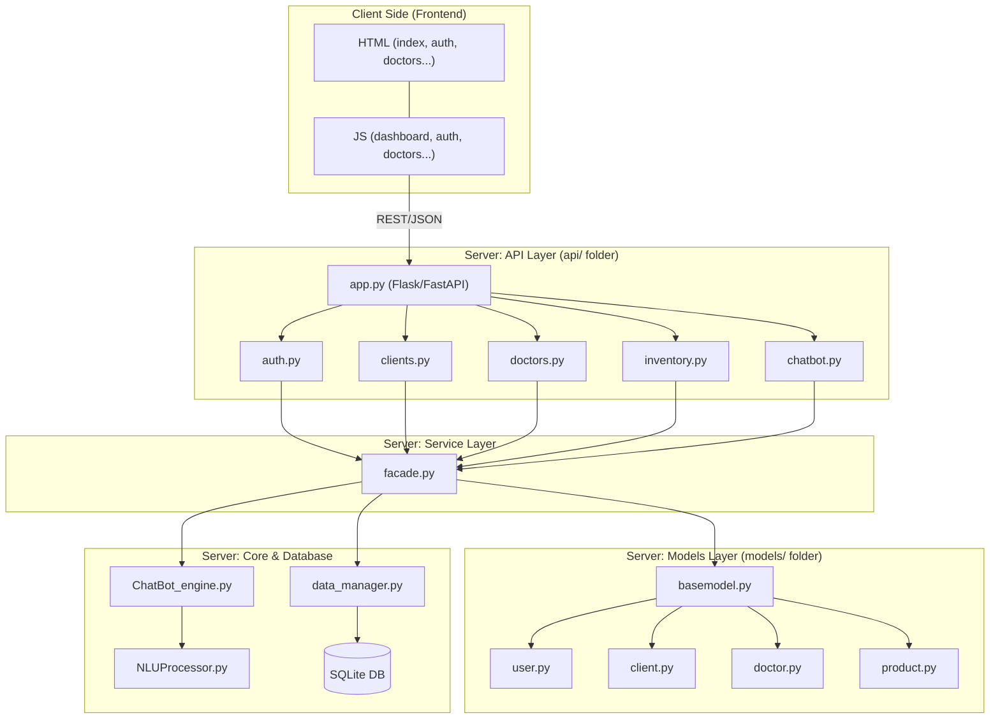
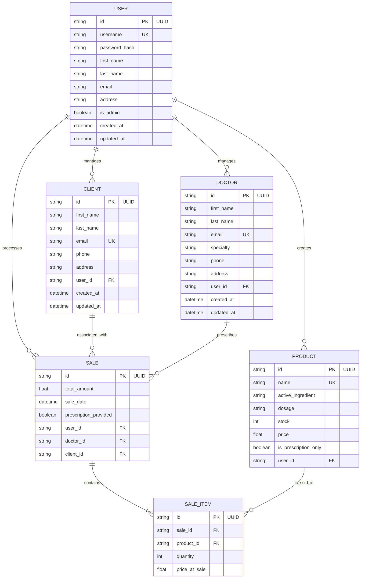
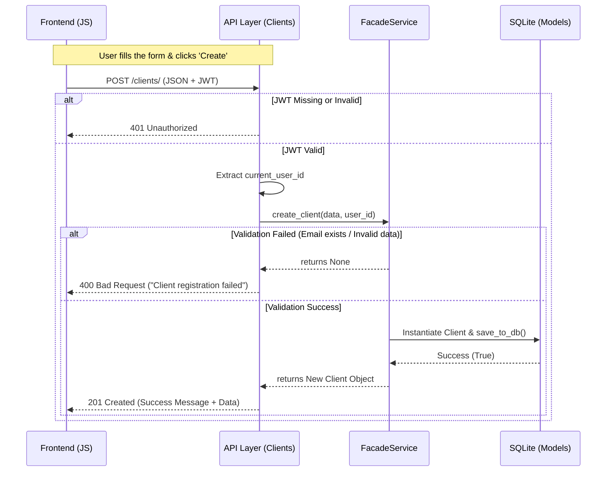
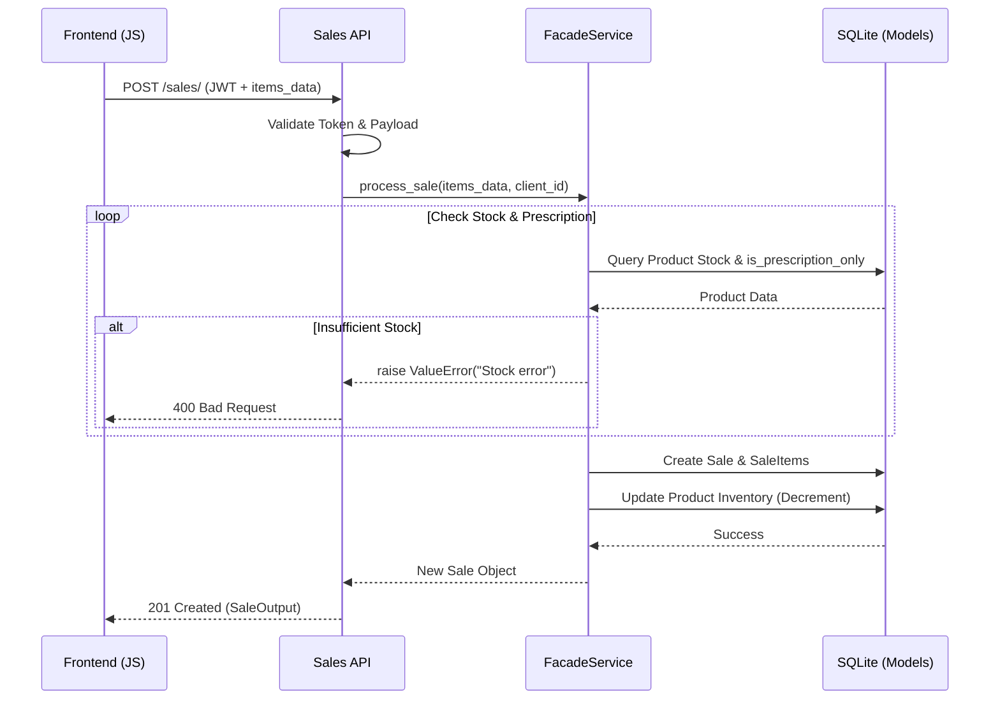
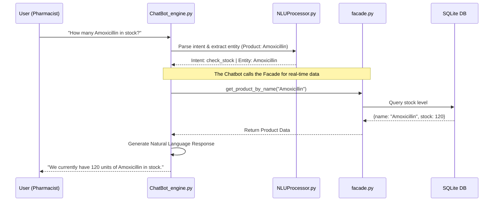
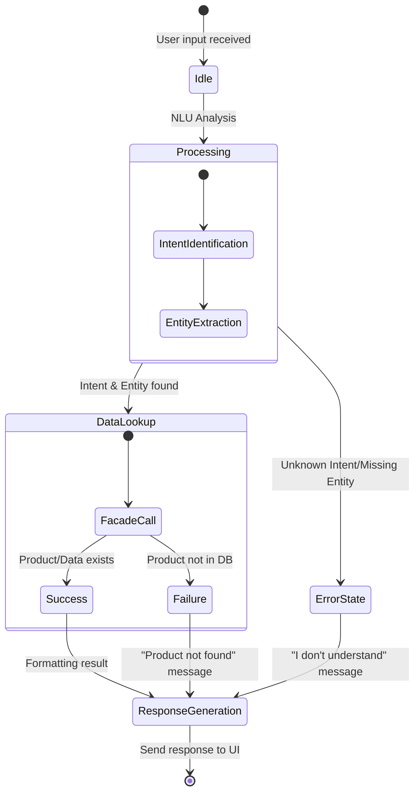

<p align="center">

</p>

# 📚 Technical Documentation: Pharma Dashboard API

This document provides the architecture, technical design, and development strategies for the **Pharma Dashboard & Chatbot** project.

# 🎯 Part 0 : User Stories and Mockups
## 0.1 Prioritized User Stories

| Role | Requirement | Goal | Priority |
| :--- | :--- | :--- | :--- |
| **Pharmacist** | As a user, I want to process a sale and check stock levels. | To ensure product availability and record transactions. | **Must** |
| **Pharmacist** | As a user, I want to register a new doctor or client on the fly. | To complete a sale requiring a prescription without delay. | **Must** |
| **Admin** | As an administrator, I want to manage employee accounts and roles. | To secure access to sensitive pharmaceutical data. | **High** |
| **Admin** | As an administrator, I want to revert a sale and restore stock. | To correct human errors in inventory management. | **High** |
| **Staff** | As a user, I want to ask the "Caducée" AI about inventory, clients, Doctors status, and more (plannings, notifications etc...). | To get hands-free, real-time data while assisting clients. | **Medium** |


## 🎨 0.2 Mockups 

<p align="center">

</p>

<em>Figure 1: Initial hand-drawn wireframe highlighting the core layout (Sidebar, KPI Cards, and Data Table). This original vision served as the blueprint for the final implementation using Material Design principles.</em> </p>


<p align="center">

</p>

<em>Figure 2: Pre-Final high-fidelity Dashboard, integrating analytical widgets, CRM management, and the "Caducée" AI assistant within a sleek Material Design interface.</em> </p>

# 🏗️ Part 1 : Design System Architecture

## 1.1 High-Level Architecture (Service-Oriented)

The application implements a **Facade Pattern** to decouple the API Layer from the Business Logic, facilitating modular maintenance of the Analytics, Inventory, and Chatbot engines.



---

# 📊 Part 2: Data & Component Design

## 2.1 Entity-Relationship (ER) Summary (Updated)


The schema is optimized for **Regulatory Compliance** and **Pharmacy Analytics**.

## 📑 Entity Details & Key Attributes

| Entity | Model File | Key Attributes (SQLAlchemy) | Purpose |
| :--- | :--- | :--- | :--- |
| **Product** | \`product.py\` | \`active_ingredient\`, \`dosage\`, \`stock\`, \`price\`, \`is_prescription_only\` | Pharmaceutical inventory management. |
| **Sale** | \`sale.py\` | \`total_amount\`, \`sale_date\`, \`prescription_provided\` | Main transaction record (The Receipt). |
| **SaleItem** | \`sale.py\` | \`quantity\`, \`price_at_sale\` | Junction table for Many-to-Many (Sale <-> Product). |
| **User** | \`user.py\` | \`username\`, \`password_hash\`, \`role\` | Auth & Ownership (\`user_id\` in Products/Sales). |
| **Doctor** | \`doctor.py\` | \`first_name\`, \`specialty\`, \`license_no\` | Regulatory reference for prescriptions. |
| **Client** | \`client.py\` | \`first_name\`, \`last_name\`, \`email\` | Patient tracking for medication history. |

## 🔗 Logic & Relationships

1. **Many-to-Many**: \`SaleModel\` and \`ProductModel\` are linked via \`SaleItemModel\`.
2. **Regulatory Link**: \`SaleModel\` includes \`doctor_id\` and \`prescription_provided\` to validate the sale of products where \`is_prescription_only=True\`.
3. **Ownership**: Every product is linked to a \`user_id\` (the person who added it to the inventory).
4. **Data Integrity**: \`SaleItemModel\` stores \`price_at_sale\` to preserve historical data even if the product price changes later.

---

# 🔄 Part 3 : Interaction and Flow Diagrams

### 3.1 Analytics & Chart Generation Flow
#### 3.1.1 Sequences diagram for POST Request for a client

#### 3.1.2 Sequences diagram for Create a sale (relation with client, and products)



### 3.2 Chatbot Query Flow


The chatbot utilizes the `facade.py` to fetch real-time stock or price data before responding to the user.

----
### 3.3 Chatbot State diagram


---
# 🔌 PART 4: API Specifications

## 4.1 External APIs & Libraries

The system leverages specific external libraries and engines to ensure pharmaceutical-grade precision and security.

| API / Library | Selection Rationale | Functional Role |
| --- | --- | --- |
| **spaCy (NLP)** | Industrial-strength NLP library with superior French language processing compared to NLTK. | Powers the **Caducée AI** engine for Intent Recognition and Entity Extraction (Medications). |
| **Flask-RESTX** | Extension for Flask that adds support for quickly building REST APIs and encourages best practices. | Generates the interactive **Swagger (OpenAPI)** documentation and handles automatic payload validation. |
| **Bcrypt** | Adaptive hashing function based on the Blowfish cipher, resistant to brute-force attacks. | Ensures secure storage of user credentials by hashing passwords before database insertion. |

---

## 4.2 Internal API Definition (Pharma-Core API)

### 🔑 Authentication & Global Headers

All requests (except `/auth/login`) must include the following header:
`Authorization: Bearer <YOUR_JWT_TOKEN>`

### 🛰️ Detailed Endpoint Specifications

| Entity | Route | Method | Required Role | Input Format | Output Format | Specific Rule |
| --- | --- | --- | --- | --- | --- | --- |
| **Auth** | `/auth/login` | `POST` | Public | JSON: `username`, `password` | JSON: `access_token`, `is_admin` | Returns identity claims. |
| **Users** | `/users/` | `GET` | Authenticated | None | Array of `User` objects | Lists all pharmacy staff. |
| **Users** | `/users/` | `POST` | **Admin** | JSON: Full Profile | Created `User` object | Prevents self-elevation of roles. |
| **Products** | `/products/` | `GET` | Authenticated | Query: `?q=name` | Array of `Product` objects | Real-time inventory lookup. |
| **Products** | `/products/` | `POST` | **Admin** | JSON: Full Pharma Data | Created `Product` object | Regulatory compliance check. |
| **Clients** | `/clients/` | `POST` | Authenticated | JSON: `Person` fields | Created `Client` object | Fast patient registration. |
| **Sales** | `/sales/` | `POST` | Authenticated | JSON: `items`, `client_id` | `Sale` Summary | **Atomic:** Updates stock & records sale. |
| **Sales** | `/sales/<id>` | `DELETE` | **Admin** | URL Parameter | `204 No Content` | **Reverts stock** upon deletion. |

---

## 4.3 Data Structures (Schemas)

### **Input Example: Create Sale (POST /sales/)**

To process a transaction, the frontend sends a structured list of items. The backend validates stock levels for each entry before committing.

```json
{
  "client_id": "550e8400-e29b-41d4-a716-446655440000",
  "doctor_id": "6eb3-41d4-a716-446655440011",
  "prescription_provided": true,
  "items": [
    {
      "product_id": "320e8400-e29b-41d4-a716-446655440022",
      "quantity": 2
    }
  ]
}

```

### **Output Example: Client Object (201 Created)**

Standardized output ensuring the frontend receives the generated UUID and timestamps.

```json
{
  "id": "550e8400-e29b-41d4-a716-446655440000",
  "first_name": "Mathieu",
  "last_name": "Godalier",
  "email": "mathieu@example.com",
  "phone": "0601020304",
  "created_at": "2025-10-22T14:30:00Z"
}

```

---

## 4.4 Error Handling & Security Mechanisms

* **Standardized Error Responses:** Every error returns a JSON body with a `message` and the corresponding HTTP status code.
* **Token Claims:** Security is enforced via JWT claims (`is_admin`). This eliminates redundant database lookups for permission checks.
* **Stock Integrity:** The `facade.py` layer ensures that deleting a sale record (Admin only) automatically restores the corresponding quantities to the inventory.
* **Payload Protection:** Strict Marshalling (via `flask-restx`) prevents unauthorized fields (like `is_admin`) from being injected during user registration.

---

# 🚀 PART 5: SCM, QA & Deployment Strategies

## 5.1 Source Control Management (SCM) Strategy

To maintain code integrity and track the evolution of the **Pharma Dashboard**, a structured Git workflow is implemented.

* **Branching Model:** A "Feature Branch" workflow is utilized:
* `main`: Production-ready code only.
* `develop`: Integration branch for finished features.
* `Mathieu`: Development branch


* **Commit Standards:** Follows the "Atomic Commit" principle—one logical change per commit with clear, descriptive messages.
* **Review Process:** Even in solo development, Pull Requests (PRs) are used to review code changes against the `develop` branch to ensure documentation and tests are updated before merging.

---

## 5.2 Quality Assurance (QA) Strategy

Quality is enforced through a multi-layered testing and analysis approach to ensure pharmaceutical data accuracy and system security.

### **Testing Types**

* **Unit Testing:** Individual logic testing for the `facade.py` and NLU processor using **PyTest**.
* **Integration Testing:** Testing API endpoints (e.g., Sales creation) to ensure the Database and API layers communicate correctly.
* **Manual Testing:** Critical user flows, such as drug-interaction alerts and chatbot responsiveness, are validated via **Postman** and the Swagger UI.

### **Automated Quality Tools**

* **Security Scanning:** **Bandit** is integrated to scan the `Server/` directory for vulnerabilities (e.g., SQL injection risks, hardcoded secrets).
* **Static Analysis:** **Pycodestyle** (PEP 8) ensures code readability and maintainability.
* **Data Consistency:** The `utils/seeder.py` script populates the database from `initial_inventory.csv` to provide a consistent environment for repeatable testing.

---

## 5.3 Deployment Pipeline

The project follows a staged deployment approach to minimize risks in a pharmacy environment.

1. **Local Development:** Code is written and linted (Pycodestyle/Bandit).
2. **Staging/Sandbox:** The application is deployed to a local server or containerized environment (Docker) for full integration testing.
3. **Production:** Final deployment to a secure server.
* **Database Migrations:** Managed via SQLAlchemy to ensure schema updates don't result in data loss.
* **Environment Variables:** Sensitive data (JWT Secrets, DB URI) are managed via `.env` files and never committed to SCM.

---

# 🚀 PART 6 : Technical Justifications

### 🏛️ Architectural Patterns
Facade Pattern: We implemented a FacadeService to act as a single entry point to the business logic. This decouples the API Layer (Flask-RESTX) from the Data Access Layer.

Justification: This ensures that if we switch from SQLite to PostgreSQL or change our ORM logic, the API routes remains entirely untouched. It centralizes transaction management and complex pharmacy rules (like stock auto-adjustment).

Data Transfer Objects (DTO) / Marshalling: Using flask-restx models for input/output.

Justification: This prevents Mass Assignment vulnerabilities. We strictly control which fields can be updated (e.g., a user cannot promote themselves to is_admin via a standard PUT request).

### 🧬 Data Modeling & OOP
Abstract Model Inheritance: Use of BaseModel and PersonModel.

Justification: This follows the DRY (Don't Repeat Yourself) principle. Common logic for UUID generation, timestamps (created_at), and database commits/rollbacks is written once and inherited by all entities, ensuring consistent behavior across the app.

Many-to-Many Relationship (Sales/Products): Implementation of a SaleItem junction table.

Justification: A direct relationship wasn't enough because we need to store state-at-sale data (like price_at_sale). This ensures that if a medication price changes tomorrow, the historical financial records for past sales remain accurate.

### 🛡️ Pharmacy-Specific Compliance
Audit-Ready Inventory: Inclusion of active_ingredient, dosage, and is_prescription_only.

Justification: Standard e-commerce templates fail in a medical context. These fields allow the Caducée AI to perform safety checks (e.g., verifying if a prescription is attached when a "Prescription Only" drug is in the cart).

Soft Deletion vs. Integrity: High-level restriction on deleting Doctors/Clients.

Justification: To maintain the integrity of prescription history, the system favors data persistence. Deleting a sale (Admin only) triggers a precise stock restoration logic to prevent "ghost inventory."

### 🗄️ Database Choice: SQLite for MVP
Justification: SQLite was chosen for the MVP phase due to its zero-configuration nature and file-based portability, which accelerates the prototyping of the "Caducée" NLU engine.

Scalability: Thanks to the Facade Pattern and SQLAlchemy ORM, the system is "PostgreSQL-ready." Transitioning to a heavy-duty production database will only require updating the ENV connection string without modifying the core business logic.
