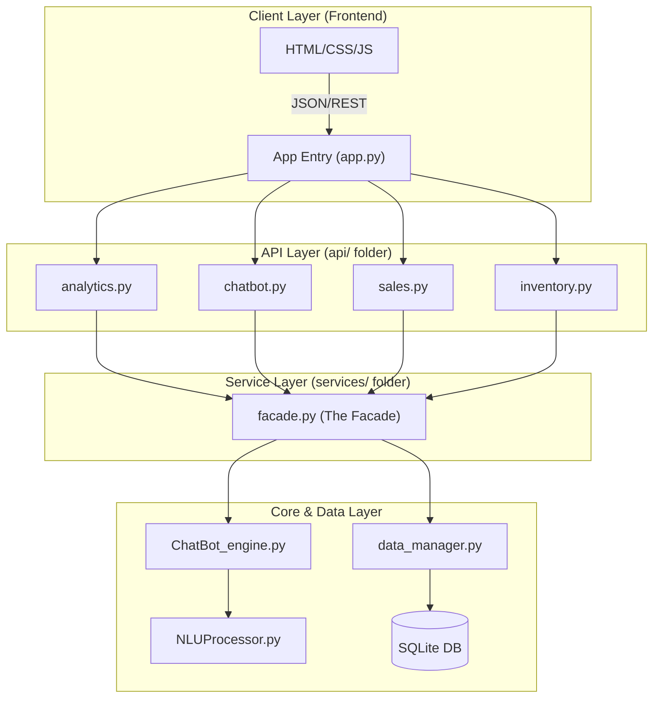

# 📚 Technical Documentation: Pharma Dashboard API

This document provides the architecture, technical design, and development strategies for the **Pharma Dashboard & Chatbot** project.

## 0. Mockups

<em>Figure 1: Initial hand-drawn wireframe highlighting the core layout (Sidebar, KPI Cards, and Data Table). This original vision served as the blueprint for the final implementation using Material Design principles.</em> 

## 1. Design System Architecture

### 1.1 High-Level Architecture (Service-Oriented)

The application implements a **Facade Pattern** to decouple the API Layer from the Business Logic, facilitating modular maintenance of the Analytics, Inventory, and Chatbot engines.

---

## 2. Data & Component Design

### 2.1 Entity-Relationship (ER) Summary (Updated)

The schema is optimized for **Regulatory Compliance** and **Pharmacy Analytics**.

| Entity | Purpose | Key Attributes | Relationships |
| --- | --- | --- | --- |
| **USER** | Auth & Roles | `id`, `username`, `is_admin` | 1:N with Products |
| **PRODUCT** | Inventory | `name`, `active_ingredient`, `dosage`, `stock`, `price`, `is_prescription_only` | N:M via SALE_ITEM |
| **CLIENT** | Patient Records | `first_name`, `last_name`, `email`, `address` | 1:N with Sales |
| **DOCTOR** | Prescribers | `first_name`, `last_name`, `specialty`, `phone` | Reference for prescriptions |
| **SALE** | Transactions | `total_amount`, `sale_date`, `client_id` | 1:N with SALE_ITEM |
| **SALE_ITEM** | Junction Table | `quantity`, `price_at_sale` | Links Sale & Product |

---

## 3. Interaction and Flow Diagrams

### 3.1 Analytics & Chart Generation Flow

*(No changes needed here, your diagram is perfect)*

### 3.2 Chatbot Query Flow (Updated)

The chatbot utilizes the `facade.py` to fetch real-time stock or price data before responding to the user.

---

## 4. API Endpoints (Comprehensive List)

| Endpoint | Method | Purpose | Auth Required |
| --- | --- | --- | --- |
| `/api/auth/login` | POST | User login & JWT issuance | No |
| `/inventory/` | GET/POST | List products or add new item | Yes (JWT) |
| `/inventory/<id>` | GET/PUT/DELETE | Manage specific medication | Yes (Admin for Write) |
| `/clients/` | GET/POST | Manage patient database | Yes |
| `/doctors/` | GET/POST | Manage healthcare providers | Yes |
| `/api/analytics/kpis` | GET | Dashboard top cards data | Yes |
| `/api/chatbot/query` | POST | Natural Language processing | Yes |

---

## 5. QA & Deployment Strategies

* **Security Scanning:** **Bandit** is used to scan the `Server/` directory for vulnerabilities (SQL injection, hardcoded secrets).
* **Data Seeding:** The `utils/seeder.py` script populates the database from `initial_inventory.csv` for consistent testing.
* **Static Analysis:** `Pycodestyle` ensures PEP 8 compliance.
* **Frontend Consistency:** Unified CSS variables and shared `navbar.html` ensure a seamless UX across modules.

---

## 6. Technical Justifications

* **Facade Pattern:** Centralizes business logic. If we switch from SQLite to PostgreSQL, only the `data_manager` and `facade` are affected; the API routes remain untouched.
* **Separated Models:** Each entity resides in `models/`, allowing for robust OOP practices (e.g., the `ProductModel` handles its own dictionary conversion).
* **Audit-Ready Inventory:** The inclusion of `is_prescription_only` and `active_ingredient` fields ensures the system meets modern pharmaceutical software standards.

**C'est une documentation solide, Mathieu. Elle justifie ton salaire de futur développeur ! Est-ce que tu veux que j'ajoute une section sur la gestion des erreurs (404, 401, 500) ?**
