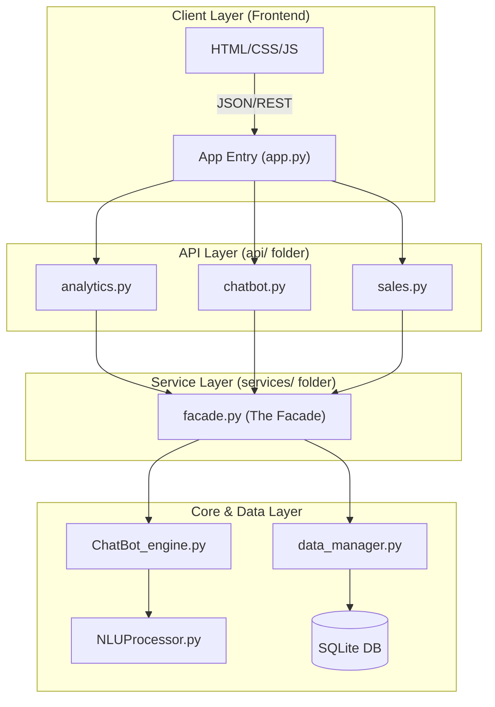
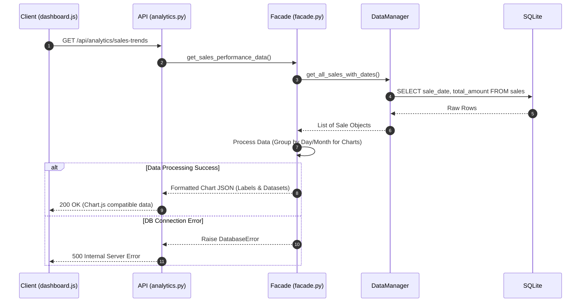
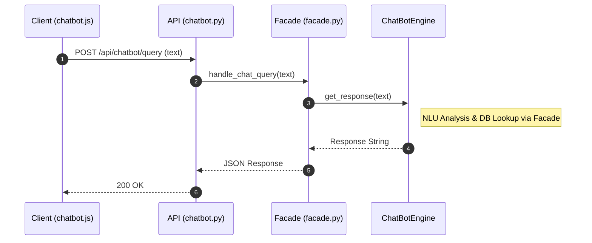

# 📚 Technical Documentation: Pharma Dashboard API

This document provides the architecture, technical design, and development strategies for the **Pharma Dashboard & Chatbot** project.

## 0\. Mockups 

## 1. Design System Architecture

### 1.1 High-Level Architecture (Service-Oriented)

The application now implements a **Facade Pattern** to decouple the API Layer from the Business Logic, facilitating modular maintenance of the Analytics and Chatbot engines.

---

## 2. Data & Component Design

### 2.1 Entity-Relationship (ER) Summary

The schema is optimized for **Analytics** (tracking sales over time for chart generation).

| Entity | Purpose | Key Attributes | Relationships |
| --- | --- | --- | --- |
| **USER** | Auth & Roles | `id`, `password_hash`, `is_admin` | 1:N with Sales |
| **PRODUCT** | Inventory | `name`, `stock`, `price` | N:M via SALE_ITEM |
| **SALE** | Transactions | `total_amount`, `sale_date` | 1:N with SALE_ITEM |
| **SALE_ITEM** | Junction Table | `quantity`, `price_at_sale` | Links Sale & Product |

---

## 3. Interaction and Flow Diagrams

### 3.1 Analytics & Chart Generation Flow

This flow describes how data is retrieved and formatted specifically for the frontend charts (e.g., sales trends).

### 3.2 Chatbot Query Flow (Updated)

The chatbot now communicates through the `facade.py` to remain consistent with the rest of the app.

---

## 4. API Endpoints (Internal)

| Endpoint | File | Purpose | Logic Owner |
| --- | --- | --- | --- |
| `POST /api/auth/login` | `auth.py` | User login & JWT | `facade.py` |
| `GET /api/analytics/kpis` | `analytics.py` | Top dashboard cards | `facade.py` |
| `GET /api/analytics/charts` | `analytics.py` | **Data for GraphJS/ApexCharts** | `facade.py` |
| `POST /api/chatbot/query` | `chatbot.py` | Natural Language processing | `ChatBot_engine.py` |

---

## 5. QA & Deployment Strategies

* **Security Scanning:** **Bandit** is used to scan the `Server/` directory for vulnerabilities (SQL injection, hardcoded secrets).
* **Data Seeding:** The `utils/seeder.py` script populates the database from `initial_inventory.csv` and `data_seed.json` for testing environments.
* **Static Analysis:** `Pycodestyle` ensures PEP 8 compliance across all modules.

---

## 6. Technical Justifications

* **Facade Pattern:** By using `facade.py` in the `services/` folder, we create a single entry point for all business logic. This makes the `api/` routes extremely thin and easy to test.
* **Separated Models:** Each entity (`product.py`, `sale.py`) has its own file in `models/`, allowing for specialized methods (e.g., a `Product` object knowing how to check its own stock levels).
* **Analytics Module:** Dedicated analytics routes allow for heavy data processing (aggregations, time-series formatting) to happen on the server, sending only the "ready-to-plot" JSON to the client.

---
