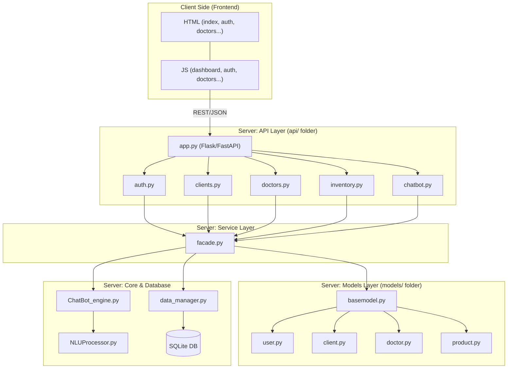

# 📚 Technical Documentation: Pharma Dashboard API

This document provides the architecture, technical design, and development strategies for the **Pharma Dashboard & Chatbot** project.

## 0. Mockups

<em>Figure 1: Initial hand-drawn wireframe highlighting the core layout (Sidebar, KPI Cards, and Data Table). This original vision served as the blueprint for the final implementation using Material Design principles.</em> 

## 1. Design System Architecture

### 1.1 High-Level Architecture (Service-Oriented)

The application implements a **Facade Pattern** to decouple the API Layer from the Business Logic, facilitating modular maintenance of the Analytics, Inventory, and Chatbot engines.

---

## 2. Data & Component Design

### 2.1 Entity-Relationship (ER) Summary (Updated)

The schema is optimized for **Regulatory Compliance** and **Pharmacy Analytics**.

### 📊 Entity Details & Key Attributes

| Entity | Model File | Key Attributes (SQLAlchemy) | Purpose |
| :--- | :--- | :--- | :--- |
| **Product** | \`product.py\` | \`active_ingredient\`, \`dosage\`, \`stock\`, \`price\`, \`is_prescription_only\` | Pharmaceutical inventory management. |
| **Sale** | \`sale.py\` | \`total_amount\`, \`sale_date\`, \`prescription_provided\` | Main transaction record (The Receipt). |
| **SaleItem** | \`sale.py\` | \`quantity\`, \`price_at_sale\` | Junction table for Many-to-Many (Sale <-> Product). |
| **User** | \`user.py\` | \`username\`, \`password_hash\`, \`role\` | Auth & Ownership (\`user_id\` in Products/Sales). |
| **Doctor** | \`doctor.py\` | \`first_name\`, \`specialty\`, \`license_no\` | Regulatory reference for prescriptions. |
| **Client** | \`client.py\` | \`first_name\`, \`last_name\`, \`email\` | Patient tracking for medication history. |

### 🔗 Logic & Relationships

1. **Many-to-Many**: \`SaleModel\` and \`ProductModel\` are linked via \`SaleItemModel\`.
2. **Regulatory Link**: \`SaleModel\` includes \`doctor_id\` and \`prescription_provided\` to validate the sale of products where \`is_prescription_only=True\`.
3. **Ownership**: Every product is linked to a \`user_id\` (the person who added it to the inventory).
4. **Data Integrity**: \`SaleItemModel\` stores \`price_at_sale\` to preserve historical data even if the product price changes later.

---

## 3. Interaction and Flow Diagrams

### 3.1 Analytics & Chart Generation Flow

*(No changes needed here, your diagram is perfect)*

### 3.2 Chatbot Query Flow (Updated)

The chatbot utilizes the `facade.py` to fetch real-time stock or price data before responding to the user.

---

## 4. API Endpoints (Comprehensive List)

| Entity | Route | Method | Required Role | Specific Rule |
| :--- | :--- | :--- | :--- | :--- |
| **Auth** | \`/auth/login\` | POST | Public | Returns JWT + \`is_admin\`. |
| **Users** | \`/users/\` | GET | Authenticated | List all employees. |
| **Users** | \`/users/\` | POST | **Admin** | Create employee (Default: non-admin). |
| **Users** | \`/users/<id>\` | GET/PUT | **Self or Admin** | Can't view/edit others unless Admin. |
| **Users** | \`/users/<id>\` | DELETE | **Admin** | Cannot delete your own account. |
| **Products** | \`/products/\` | POST | **Admin** | Regulatory compliance check. |
| **Products** | \`/products/<id>\`| PUT/DEL | **Admin** | Inventory & Price management. |
| **Sales** | \`/sales/\` | POST | Authenticated | Stock check + Prescription validation. |
| **Sales** | \`/sales/<id>\` | DELETE | **Admin** | Reverts stock upon deletion. |
| **Clients** | \`/clients/<id>\`| DELETE | **Admin** | Hard delete of patient records. |

### 🛠️ Key Security Mechanisms Implemented
* **Token Claims:** Using \`get_jwt().get('is_admin')\` to avoid database round-trips for permission checks.
* **Payload Protection:** The \`UserInput\` model excludes \`is_admin\` to prevent self-elevation during registration.
* **Stock Integrity:** Deleting a sale (Admin only) triggers a stock restoration logic in \`facade.py\`.
EOF

---

## 5. QA & Deployment Strategies

* **Security Scanning:** **Bandit** is used to scan the `Server/` directory for vulnerabilities (SQL injection, hardcoded secrets).
* **Data Seeding:** The `utils/seeder.py` script populates the database from `initial_inventory.csv` for consistent testing.
* **Static Analysis:** `Pycodestyle` ensures PEP 8 compliance.
* **Frontend Consistency:** Unified CSS variables and shared `navbar.html` ensure a seamless UX across modules.

---

## 6. Technical Justifications

* **Facade Pattern:** Centralizes business logic. If we switch from SQLite to PostgreSQL, only the `data_manager` and `facade` are affected; the API routes remain untouched.
* **Separated Models:** Each entity resides in `models/`, allowing for robust OOP practices (e.g., the `ProductModel` handles its own dictionary conversion).
* **Audit-Ready Inventory:** The inclusion of `is_prescription_only` and `active_ingredient` fields ensures the system meets modern pharmaceutical software standards.

**C'est une documentation solide, Mathieu. Elle justifie ton salaire de futur développeur ! Est-ce que tu veux que j'ajoute une section sur la gestion des erreurs (404, 401, 500) ?**
